# Instalación de Linux en partición de disco

## Creación de partición del disco

El primer paso para la instalación de Linux preservando el sistema operativo original, es crear una partición del disco, para esto se debe entrar a la seccion de "crear y formatear particiónes del disco duro" en la configuración del PC:

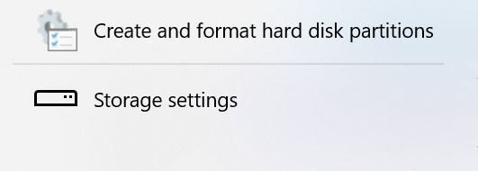

Luego se debe abrira la ventana de "Disk Management" en esta se pueden observar como esta organizado el almacenamiento del PC:

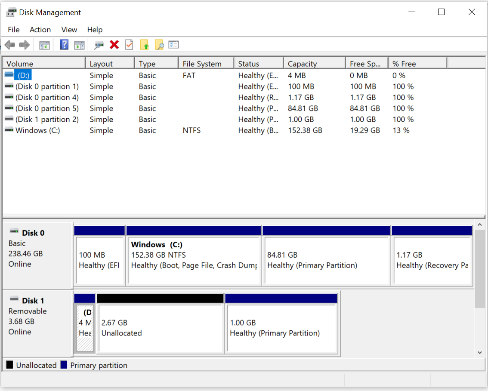

Se seleccióna el disco donde se pretende realizar la particion y se seleccióna la opción de "Shrink Volume" y se define cuanto almacenamiento tendra la nueva partición a crear:

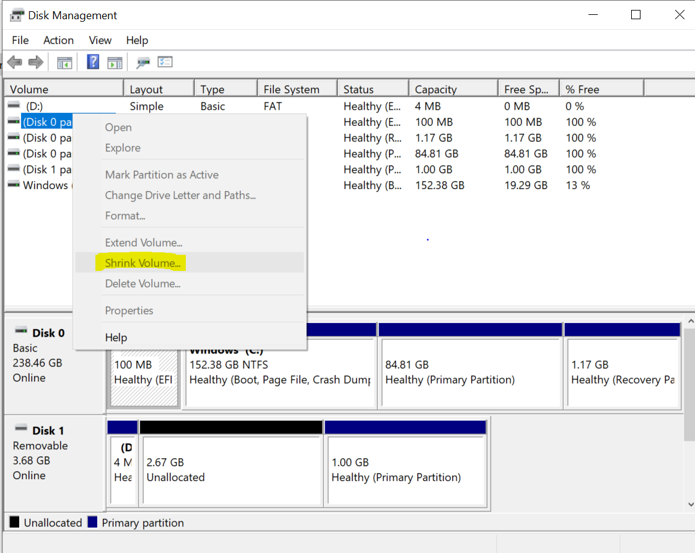

Finalmente en la pestaña de "Disk Managment" se podra ver la nueva partición creada lista para el siguente paso en la instalación de Linux:

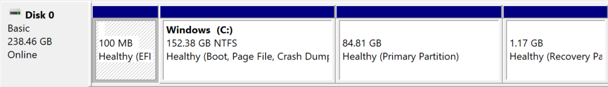

## Intento fallido de instalación de Linux Mint 21.3:

En el caso particular tratado ya se tenia una version de Ubuntu 20.04 LTS sin embargo se presentaban problemas con los drivers necesarios para el reconocimiento de la tarjeta de red del PC, esto probablemente debido a errores en la instalación del sistema operativo, por esta razon se planteo inicalmente la instalación de la distribución Mint 21.3 pensando que esta distribución podria incluir los drivers requeridos.

Ya con la creación de la partición del disco el siguente paso para seguir con la instalación de Linux es realizar un boot desde una USB con la distiribución de Linux que se desea, para esto se debe entrar a la BIOS o UEFI (Unified Extensible Firmware Interface), para hacer esto en el momento cuando el PC esta iniciando se presiona una tecla (normalmente F12 o esc) multiples veces, esto permite ingresar a la siguiente ventana: 

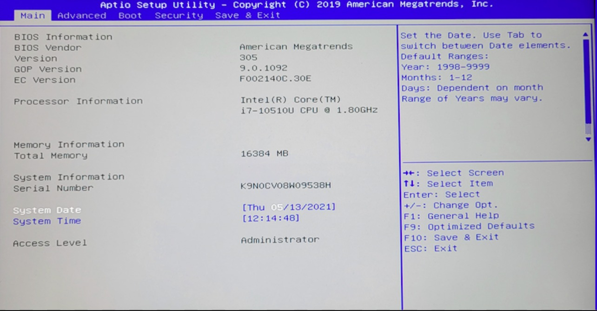

En la ventana de la BIOS se debe entrar a la pensataña de Boot ahi se puede selecciónar el dispositivo desde el cual se realizara el Boot, se debe seleccionar la USB ya que ahi de tiene la distribución de Linux a instalar.

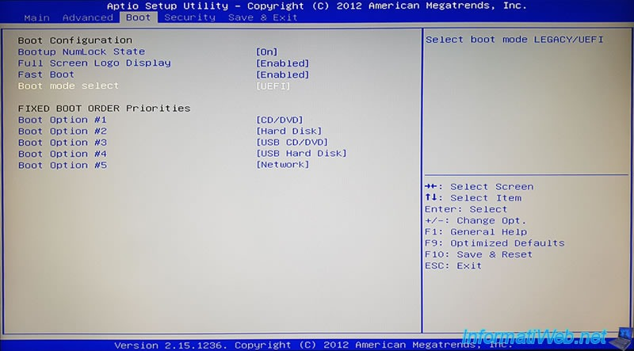

Luego de seleccionar desde que punto se realizaria el BOOT se guardan los cambios y se comienza la instalación, sin embargo al finalizar esta instalación e intentar ingrear a Linux Mint, por alguna razon no identificada, se seguia ingresando a la version de Ubuntu que se habia instalado inicialmente en el PC, para solucionar este problema se planteo borrar la partición  del disco donde se habia instalado Ubunto y volver a instalar Linux, sin embargo se tenia la preocupación de que al hacer esto no se pudiera acceder al boot de Windows, esto ya que en la Bios solo aparecia un Boot para Ubuntu.

Luego de Borrar la partición de Ubuntu y reiniciar el PC sucedio lo que se temia, se perdio la posibilidad de acceder a Windows y como se habia borrado la particion de Ubuntu el PC quedo sin un sistema operativo.

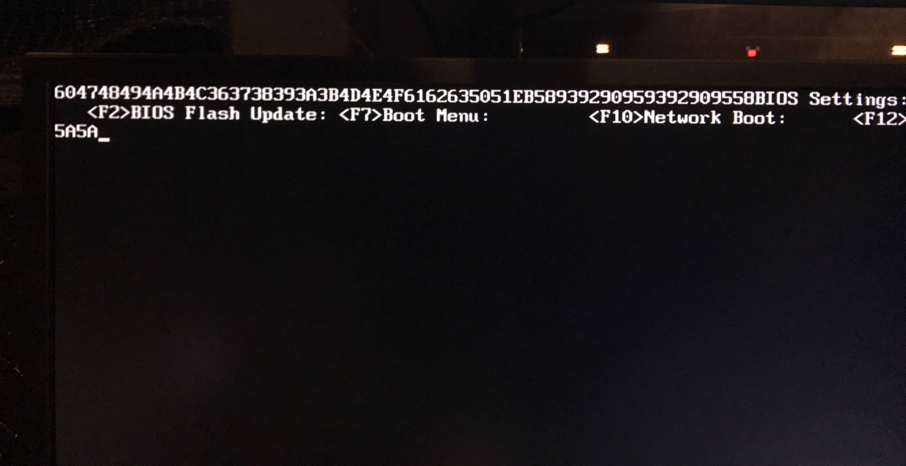

Luego para recuperar un sistema operativo se repitio el proceso  anterior para instalar Mint nuevamente en la partición donde se tenia Ubuntu, sin embargo al finalizar el proceso e intentar inicializar Mint nuevamente se inicio una version de Ubunto con errores donde no funcionaba el mouse ni los drivers de que permitian leer la trajeta de internet, debido a esto se decidio probar con una instalción de Ubuntu nuevamente pero ahora de la version 22.04.2 LTS.

## Instalación de Linux Ubuntu 22.04.2 LTS:

Para Instalar la version de Ubuntu 22.04.2 LTS se realizo el proceso  en la BIOS anteriormente explicado , sin embargo esta vez se selecciono una USB con Ubunto para realizar el BOOT, luego de esto comenzo la instalación con la 

# instalación de herramienta de programación  Quartus en Linux

## Descargar instalador

Debe acceder a la página oficial de [intel](https://www.intel.com/content/www/us/en/software-kit/795187/intel-quartus-prime-lite-edition-design-software-version-23-1-for-linux.html) para descargar el archivo ".run", asegurese de que esté bien seleccionado el sistema operativo y la última versión disponible del programa.

Proceda a presionar el botón de descargar.

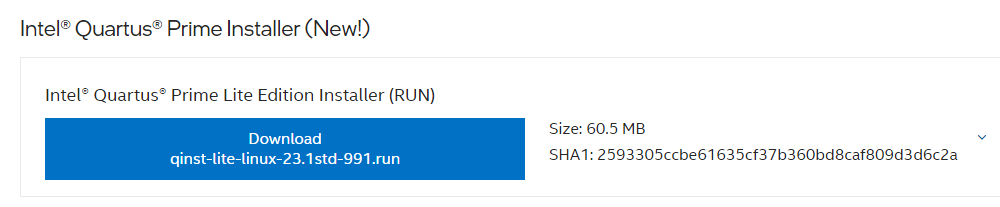

## Ejecutar instalador

Cuando finalice la descarga, diríjase a su terminal y ubíquese en la carpeta donde descargó el ".run", una vez ahí ejecute el siguiente comando

    chmod +x qinst-lite-linux-23.1std-991.run

Con esto ahora podrá abrir el instalador desde la terminal con este comando

      ./qinst-lite-linux-23.1std-991.run

Una vez abierto el instalador, fíjese bien en que la carpeta predeterminada donde se descargarán los archivos sean en su carpeta **home** y no en la carpeta **root**, ya que si esto pasa, la computadora no podrá acceder al programa.

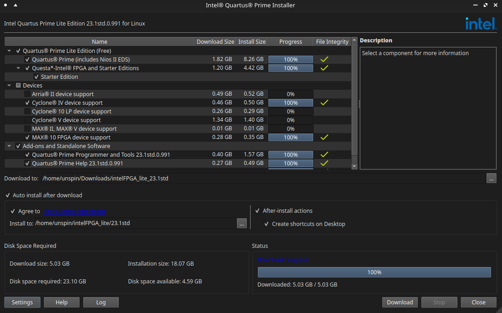

Marque las casillas *Quartus&reg; Prime Lite Edition (Free)* ,  *Add-ons and Standalone Software* , y la casilla de la FPGA con la cual va a trabajar, en este caso se usará la **Cyclone&reg; IV** por lo que se marcará *Cyclone&reg; IV device support* . También asegúrese de que la casilla de *Auto install after download* esté marcada.

Por último marque la casilla *Agree to Intel license Agreement* y oprima el botón de descargar *Download* y espere a que termine la instalación.

## Ejecutar programa

Una vez terminada la instalación, confirme que se descargaron las carpetas en sus respectivos sitios

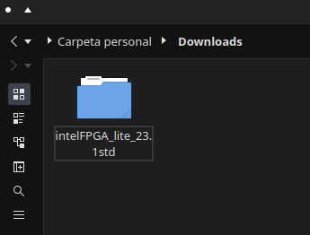 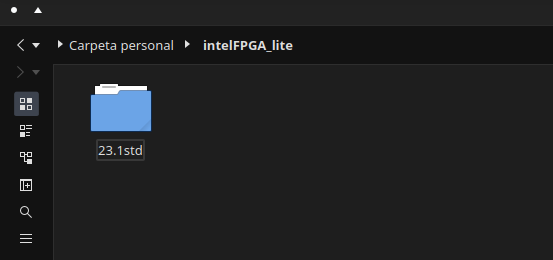 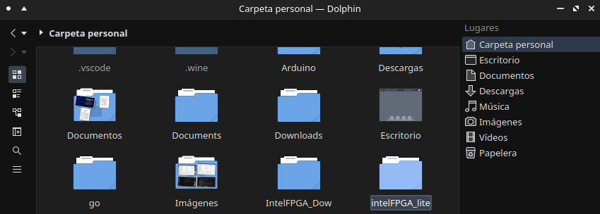

Si está todo bien, diríjase a su carpeta personal **home** y busque y ejecute el archivo *.bashrc*, en él vaya en la parte de abajo del todo y agregue el siguiente texto

    export ALTERAPATH="/home/user/intelFPGA_lite/23.1std/"
    export QUARTUS_ROOTDIR=${ALTERAPATH}/quartus
    export QUARTUS_ROOTDIR_OVERRIDE="$QUARTUS_ROOTDIR"
    export PATH=$PATH:${ALTERAPATH}/quartus/sopc_builder/bin
    export PATH=$PATH:${ALTERAPATH}/nios2eds/bin
    export PATH=$PATH:${QSYS_ROOTDIR}

***Recuerde que es completamente necesario cambiar donde dice "user" por el nombre de su usuario***

y también **ENCUENTRE** y marque como comentario (agregando un "#" al inicio) esta línea de texto

ANTES

    export QSYS_ROOTDIR="/home/user/intelFPGA_lite/23.1std/quartus/sopc_builder/bin

DESPUES

    #export QSYS_ROOTDIR="/home/user/intelFPGA_lite/23.1std/quartus/sopc_builder/bin

luego de esto regrese a la terminal y corra el siguiente comando desde el **home** (si no está ahí puede acceder fácilmente escribiendo "~") 

    sudo ln -s $QUARTUS_ROOTDIR/bin/quartus /bin/quartus

Con esto hecho deberá ser capaz de ejecutar quartus corriendo desde la terminal el comando `quartus` 

Si esto no le funciona, diríjase a la carpeta */home/unspin/intelFPGA_lite/23.1std/quartus/bin/*, busque el archivo *quartus* y ejecutelo con el comando `./quartus`

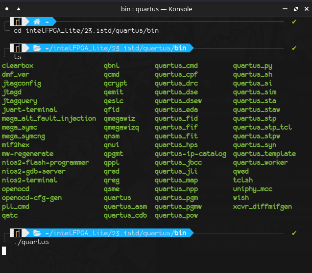

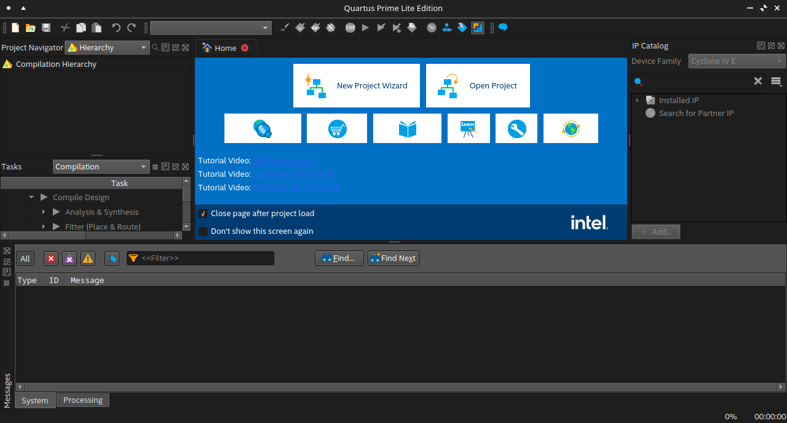

------------------------------------------------------------------------------------------------------------
# Instalación de la herramienta de simulación Questa
Se hará un tutorial para para la instalación del simulador Questa para el sistema operativo Windows en versión 23.1.
* ### Descargar el instalador

 Como primer paso se debe descargar los archivos Questa*-Intel® FPGA Edition de la [página oficial de intel](https://www.intel.com/content/www/us/en/software-kit/776289/questa-intel-fpgas-pro-edition-software-version-23-1.html) Se debe descargar el archivo .exe y .qdz para Windows.

 
 
> Archivos a descargar

## Instalación
* Para iniciar con la instalación se debe ejecutar como administrador el archivo .exe que se descargó previamente.

* Luego de ejecutar el archivo nos aparecerá esta ventana:

 
 
* Seguimos los pasos y el simulador se empezará a instalar (veasé la siguiente imagen)

## Configuración de licencia
Es necesario para su correcto funcionamiento descargar la licencia de Questa por lo tanto seguir los siguientes pasos:

*  Ingresar al **Self-Service Licensing Center de Intel** en la [página oficial de intel](https://licensing.intel.com/psg/s/?language=en_US). Luego haga click en el enlace Enroll for Intel® FPGA Self Service Licensing Center (SSLC) (Veasé imagen) y luego cree una cuenta. 

* Inicie sesión en **Intel Azure Portal** [AQUI](https://login.microsoftonline.com/46c98d88-e344-4ed4-8496-4ed7712e255d/oauth2/authorize?client_id=2793995e-0a7d-40d7-bd35-6968ba142197&redirect_uri=https%3A%2F%2Flauncher.myapps.microsoft.com%2Fapi%2Fsignin-oidc&response_type=code&scope=openid%20profile%20offline_access&code_challenge=l621EbMpMd8XCMUt32fOkdVx4LQ85OhcOiA9DS9mPMQ&code_challenge_method=S256&response_mode=form_post&nonce=638435098500409634.ZjJmMDY1YzYtZjM0OC00YmIxLWI4NWUtNTlkMmU0MGJjYzgxZmY1ZjkyNDgtOGIxOS00YmEyLTk1ZjctODIxOGQ1ZjYwMjA4&client_info=1&x-client-brkrver=IDWeb.2.13.2.0&state=CfDJ8E3NALe6oY1JvkTnnsQsCGyFKIDx-4SbDtmZoJPUlgmKjsHRPSR5otWRAPY5N420c27dON5pWiPUFCv8RYxYwnS4IEfWxDcSsGyPwd4qgm_yFUW2Oc6q80X7YhH4M6Qm0icDBQ4KM6MI5OzEtjYAfBNwkfCX42xjVa3wP9qfIrf5Pr9UpIKnh2Ao2bzxA05ltw07cQHfXxGVB4qWp75KPYLx1aplPrnEREmGZy_KRilW6ix08U5NCks8Y4ASbS2-LGUwR_HW6T163bZ8VvyPvFScu6rkH00tmrEEkvZ6EHNfnv9kpGW-CV_s2XG4xsm31sXMnamANcz5UcfPxQ3FW2k_y2X1tS7ckJu25ZbLLL98pTZ8rMueWU26653lNGb40l-6c1hmipyOPaWbfWtrfCq6IPKikdz_drSK3InXvBPoayBqA3UCZ-0bzxFzVDC1g3qFaycOLCFha2bAOn27QuT6xqexH-AZxmfCwnahlTfd3jJUCVaZ6Tvs17YtZT7R_CKJbsQr2BWkvql8oEUB7OI&x-client-SKU=ID_NET6_0&x-client-ver=6.35.0.0).

	* Se deben seguir todos los pasos, uno de ellos consiste en escanear un código QR, en caso de no ser posible usar la opción **I want to set up a different methode**, con la cual se enviará un código como mensaje SMS al celular para ingresar.
	* Leer y aceptar los términos de uso.

* Al terminar esto se abrirá el siguiente portal (Véase la siguiente imagen)
* Ingresar a la opción **Sing up for Evaluation or No-Cost License**.

* Seleccionar la opción **Questa*-Intel® FPGA Starter** y dar click en Next.

* Se abrirá una interfaz para generar la licencia. Dar click en **+New Computer**.

* Como paso siguiente se debe llenar el formulario de la siguiente manera:
	* **License type**: FIXED.
	* **Computer type**: NIC ID.
	* **Primary Computer**
		*En la terminal de ubuntu con WSL ejecutamos el comprando **ifconfig**
		* El NIC ID corresponde al número de la mac del driver de wifi o ethernet, para wifi aparecerá en la opción wlp1s0 junto a la palabra ether.
		* Copiar todo el string que está separado por dos puntos ":", pero en la casilla Primary Computer ID borrarlos, para dejar sólo los caracteres alfanuméricos.

	* Dar click en save, aceptar términos de uso y dar click en generar.
* Recibirá un correo con un archivo adjunto con extensión .dat correspondiente a la licencia. Descargue el archivo.

## Configuración de licencia en la IDE de Quartus
Para configurar la licencia previamente descargada debe abrir el sofware de Quartus, luego, siga los siguientes pasos.

* En el menú vaya a la opción **Tools**>>**Licence setup** (Veasé la imagen)

* En la casilla **License file** cargar el archivo de la licencia .dat que se descargó previamente.

* Configuración de variables de entorno de la licencia:
	* Para este paso vaya a "**Editar las variables de entorno del sistema**" en el sistema operativo Windows. Le aparecerá la siguiente ventana.

	

	 * Debe dar click en "**Variables de entorno**" y agregar la dirección de donde tenga guardada la licencia tanto en "**Variables de usuario**" como en "**Variables del sistema**".

## Listo para usar :)
