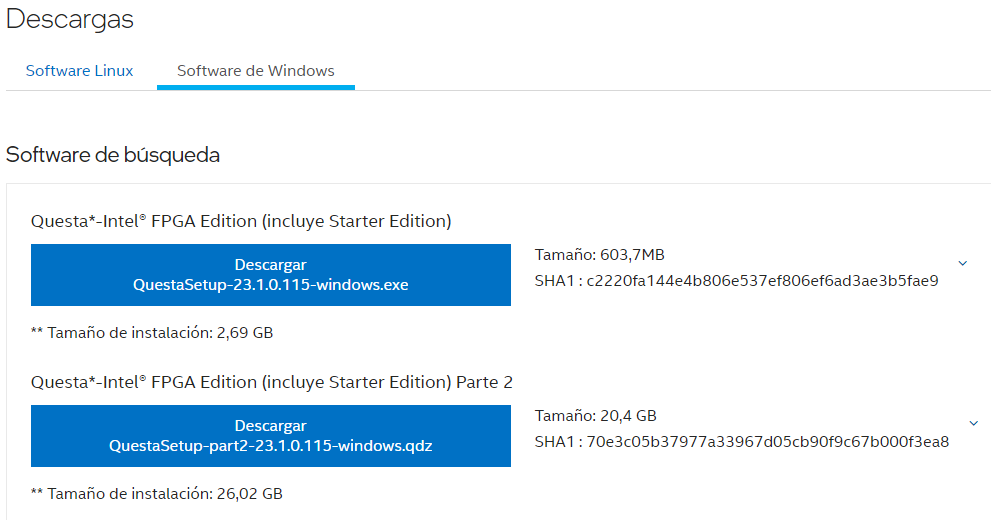
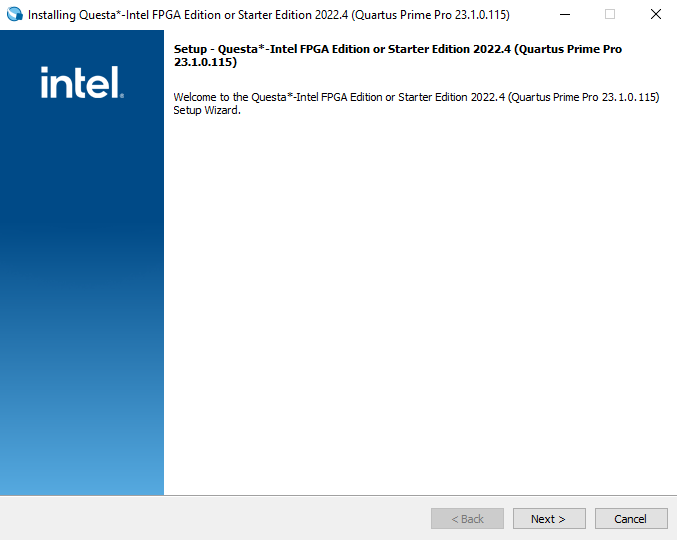
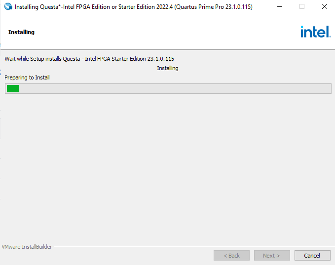
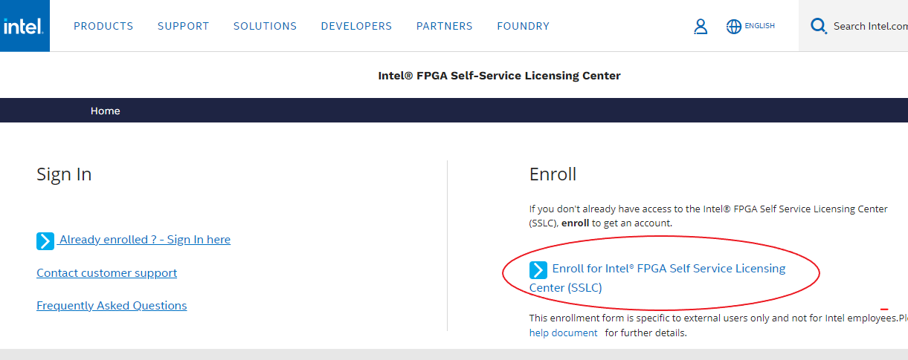
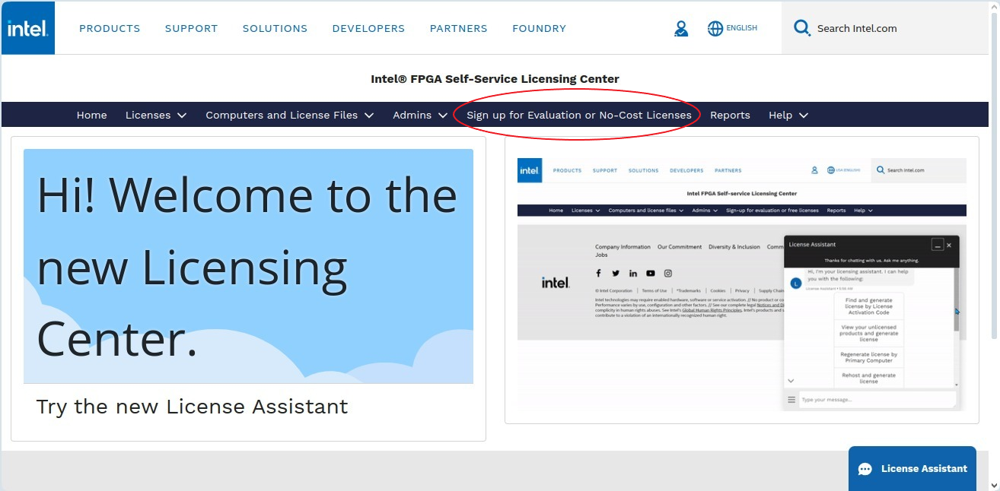
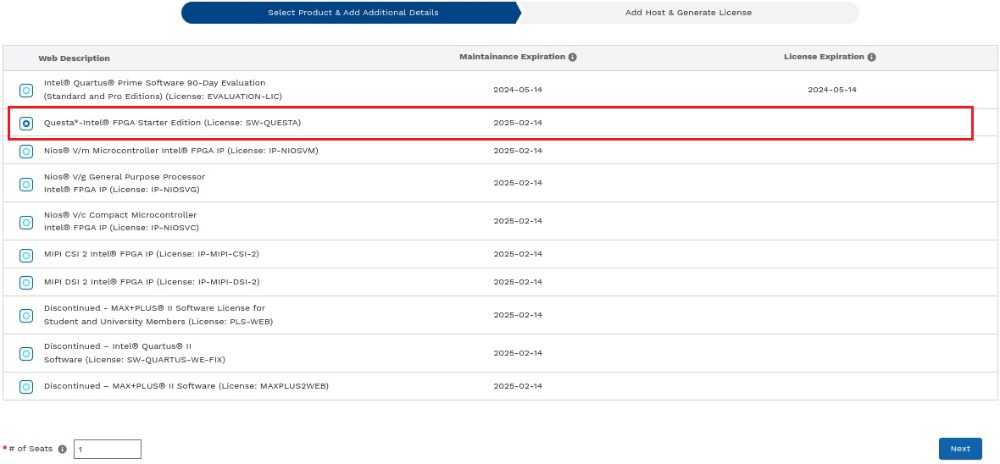
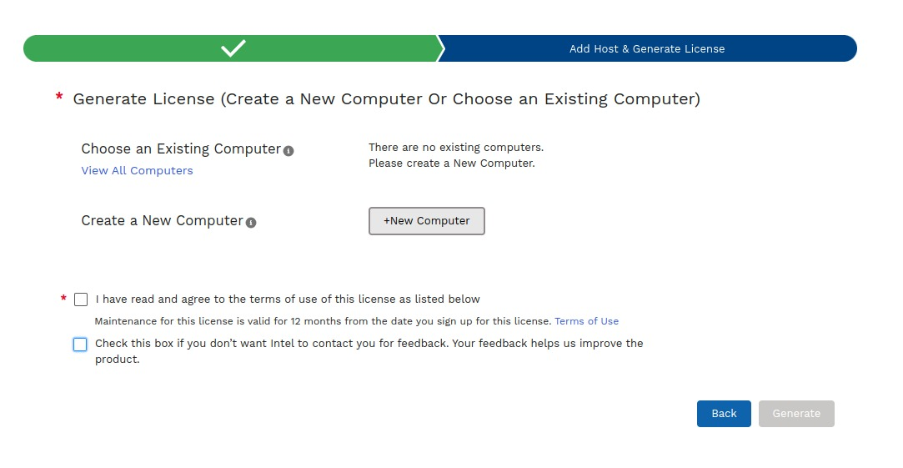
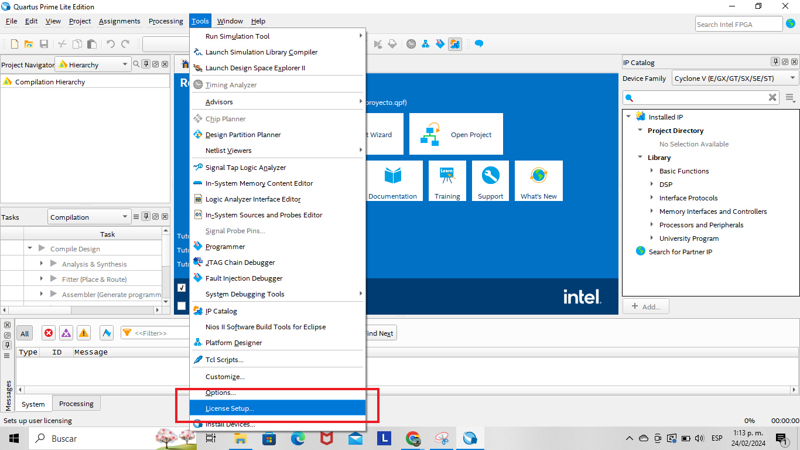
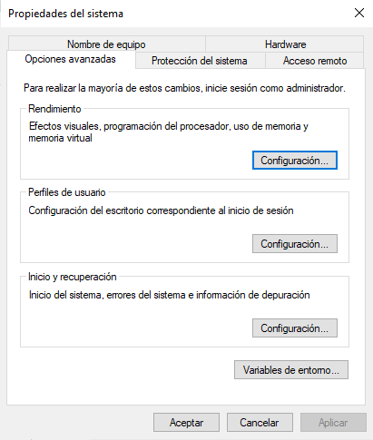

------------------------------------------------------------------------------------------------------------
# Instalación de la herramienta de simulación Questa
Se hará un tutorial para para la instalación del simulador Questa para el sistema operativo Windows en versión 23.1.
* ### Descargar el instalador

 Como primer paso se debe descargar los archivos Questa*-Intel® FPGA Edition de la [página oficial de intel](https://www.intel.com/content/www/us/en/software-kit/776289/questa-intel-fpgas-pro-edition-software-version-23-1.html) Se debe descargar el archivo .exe y .qdz para Windows.

 
 
> Archivos a descargar

## Instalación
* Para iniciar con la instalación se debe ejecutar como administrador el archivo .exe que se descargó previamente.

* Luego de ejecutar el archivo nos aparecerá esta ventana:

 
 
* Seguimos los pasos y el simulador se empezará a instalar (veasé la siguiente imagen)

## Configuración de licencia
Es necesario para su correcto funcionamiento descargar la licencia de Questa por lo tanto seguir los siguientes pasos:

*  Ingresar al **Self-Service Licensing Center de Intel** en la [página oficial de intel](https://licensing.intel.com/psg/s/?language=en_US). Luego haga click en el enlace Enroll for Intel® FPGA Self Service Licensing Center (SSLC) (Veasé imagen) y luego cree una cuenta. 

* Inicie sesión en **Intel Azure Portal** [AQUI](https://login.microsoftonline.com/46c98d88-e344-4ed4-8496-4ed7712e255d/oauth2/authorize?client_id=2793995e-0a7d-40d7-bd35-6968ba142197&redirect_uri=https%3A%2F%2Flauncher.myapps.microsoft.com%2Fapi%2Fsignin-oidc&response_type=code&scope=openid%20profile%20offline_access&code_challenge=l621EbMpMd8XCMUt32fOkdVx4LQ85OhcOiA9DS9mPMQ&code_challenge_method=S256&response_mode=form_post&nonce=638435098500409634.ZjJmMDY1YzYtZjM0OC00YmIxLWI4NWUtNTlkMmU0MGJjYzgxZmY1ZjkyNDgtOGIxOS00YmEyLTk1ZjctODIxOGQ1ZjYwMjA4&client_info=1&x-client-brkrver=IDWeb.2.13.2.0&state=CfDJ8E3NALe6oY1JvkTnnsQsCGyFKIDx-4SbDtmZoJPUlgmKjsHRPSR5otWRAPY5N420c27dON5pWiPUFCv8RYxYwnS4IEfWxDcSsGyPwd4qgm_yFUW2Oc6q80X7YhH4M6Qm0icDBQ4KM6MI5OzEtjYAfBNwkfCX42xjVa3wP9qfIrf5Pr9UpIKnh2Ao2bzxA05ltw07cQHfXxGVB4qWp75KPYLx1aplPrnEREmGZy_KRilW6ix08U5NCks8Y4ASbS2-LGUwR_HW6T163bZ8VvyPvFScu6rkH00tmrEEkvZ6EHNfnv9kpGW-CV_s2XG4xsm31sXMnamANcz5UcfPxQ3FW2k_y2X1tS7ckJu25ZbLLL98pTZ8rMueWU26653lNGb40l-6c1hmipyOPaWbfWtrfCq6IPKikdz_drSK3InXvBPoayBqA3UCZ-0bzxFzVDC1g3qFaycOLCFha2bAOn27QuT6xqexH-AZxmfCwnahlTfd3jJUCVaZ6Tvs17YtZT7R_CKJbsQr2BWkvql8oEUB7OI&x-client-SKU=ID_NET6_0&x-client-ver=6.35.0.0).

	* Se deben seguir todos los pasos, uno de ellos consiste en escanear un código QR, en caso de no ser posible usar la opción **I want to set up a different methode**, con la cual se enviará un código como mensaje SMS al celular para ingresar.
	* Leer y aceptar los términos de uso.

* Al terminar esto se abrirá el siguiente portal (Véase la siguiente imagen)
* Ingresar a la opción **Sing up for Evaluation or No-Cost License**.

* Seleccionar la opción **Questa*-Intel® FPGA Starter** y dar click en Next.

* Se abrirá una interfaz para generar la licencia. Dar click en **+New Computer**.

* Como paso siguiente se debe llenar el formulario de la siguiente manera:
	* **License type**: FIXED.
	* **Computer type**: NIC ID.
	* **Primary Computer**
		*En la terminal de ubuntu con WSL ejecutamos el comprando **ifconfig**
		* El NIC ID corresponde al número de la mac del driver de wifi o ethernet, para wifi aparecerá en la opción wlp1s0 junto a la palabra ether.
		* Copiar todo el string que está separado por dos puntos ":", pero en la casilla Primary Computer ID borrarlos, para dejar sólo los caracteres alfanuméricos.

	* Dar click en save, aceptar términos de uso y dar click en generar.
* Recibirá un correo con un archivo adjunto con extensión .dat correspondiente a la licencia. Descargue el archivo.

## Configuración de licencia en la IDE de Quartus
Para configurar la licencia previamente descargada debe abrir el sofware de Quartus, luego, siga los siguientes pasos.

* En el menú vaya a la opción **Tools**>>**Licence setup** (Veasé la imagen)

* En la casilla **License file** cargar el archivo de la licencia .dat que se descargó previamente.

* Configuración de variables de entorno de la licencia:
	* Para este paso vaya a "**Editar las variables de entorno del sistema**" en el sistema operativo Windows. Le aparecerá la siguiente ventana.

	

	 * Debe dar click en "**Variables de entorno**" y agregar la dirección de donde tenga guardada la licencia tanto en "**Variables de usuario**" como en "**Variables del sistema**".

## Listo para usar :)
