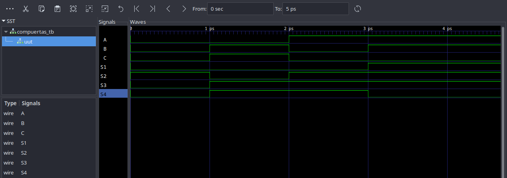
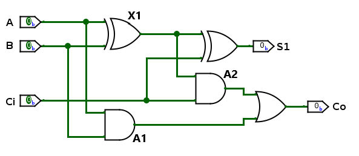
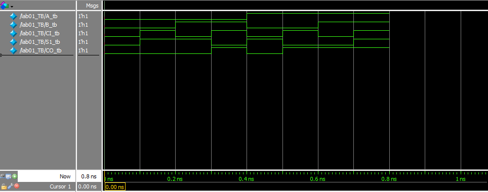

# Informe Laboratorio 01 
## Punto 1: Compuertas Lógicas en Icarus Verilog y GTKWave.

 La primera parte del laboratorio consistía en programar desde Quartus, las siguientes compuertas lógicas: AND, NOT, OR y XOR esto se hizo en Verilog como se puede ver en el archivo `Laboratorio001/src/compuertas.v`, en el programa se definieron las salidas desde `S1`,`S2`,`S3` y `S4`, y las entradas como `A`, `B` y `C`, luego se le asignó a cada salida logical correspondiente de cada compuerta lógica deseada, `S1` para AND, `S2` para NOT, `S3` para OR y `S4` para XOR.

La segunda parte del laboratorio fue la programación del Testbench que se utilizaría para simular las compuertas lógicas del archivo `Laboratorio001/src/compuertas.v`, para esto se definieron las entradas como `reg` y las salidas como `wire`, posteriormente se definieron todas las combinaciones de "1" o "0" de las variables, para obtener todas las salidas posibles, finalmente se escribió un pequeño script para crear un archivo `.vcd` para la posterior simulación con GTKWave, todo lo anterior se puede ver en el archivo `Laboratorio001/src/compuertas_tb.v`.

 La última parte del laboratorio consistió en la simulación de las compuertas lógicas con GTKWave, para esto desde la carpeta `Laboratorio001/src/build` en el terminal se ejecutó el siguiente comando `gtkwave compuertas.vcd` esto comenzó la simulación que tuvo los resultados que se pueden observar en la siguiente imagen:

 

 Como se puede observar en la imagen superior, todas las posibilidades que se podrían expresar en una tabla de verdad para cada una de las compuertas seleccionadas quedan expresadas en la simulación con GTKWave.

| A   | B   | S1  | S3  | S4  | C   | S2  |
| --- | --- | --- | --- | --- | --- | --- |
| 0   | 0   | 0   | 0   | 0   | 0   | 1   |
| 0   | 1   | 0   | 1   | 1   | 1   | 0   |
| 1   | 0   | 0   | 1   | 1   | 0   | 1   |
| 1   | 1   | 1   | 1   | 0   |     |     |

## Punto 2: Sumador de bits en Quartus.

Para poder hacer el circuito completo, primero definimos las entradas lógicas `A`, `B` y `Ci`, y a la vez las primeras salidas de cada operador `X1`$=A\oplus B$, `A1`$=A\land B$ y `A2`$=X1 \land Ci$ y las últimas salidas `S1`$=X1\oplus Ci$ y `Co`$=A1\lor A2$, en el archivo `Laboratorio001/src/lab01.v` luego se compila con Quartus y creamos el Testbench `Laboratorio001/src/simulacion01.v` con todas las posibilidades para `A_tb`, `B_tb` y `Ci_tb` como `reg` y `S1_tb`, y `Co_tb` como `wire`. Luego esto lo ponemos en Questa y obtenemos la siguiente imagen 

y con esta la tabla de verdad

| A   | B   | Ci  | X1  | A1  | A2  | S1  | Co  |
| --- | --- | --- | --- | --- | --- | --- | --- |
| 0   | 0   | 0   | 0   | 0   | 0   | 0   | 0   |
| 0   | 0   | 1   | 0   | 0   | 0   | 1   | 0   |
| 0   | 1   | 0   | 1   | 0   | 0   | 1   | 0   |
| 0   | 1   | 1   | 1   | 0   | 1   | 0   | 1   |
| 1   | 0   | 0   | 1   | 0   | 0   | 1   | 0   |
| 1   | 0   | 1   | 1   | 0   | 1   | 0   | 1   |
| 1   | 1   | 0   | 0   | 1   | 0   | 0   | 1   |
| 1   | 1   | 1   | 0   | 1   | 1   | 1   | 1   |

