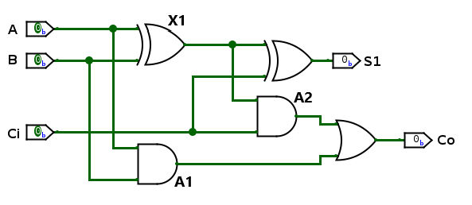

# Laboratorio 002 - Sumador de 1 y 4 bits

## Sumador de un 1 bit
Para realizar el circuito eléctrónico sumador de un bit, hicimos uso de dos compuertas XOR, dos compuertas AND y una compuerta OR. Vease la siguiente imagen.



El primer paso a seguir en la construcción del circuito es definir las entradas, que son, A, B y Ci (Acarreo de entrada). Luego, se define las salidas de cada operación lógica. Vease el siguiente bloque de código.

```verilog
module lab01(A,B,CI,S1,CO);
input A;
input B;
input CI;

output S1;
output CO;

wire X1; // salida de compuerta XOR 1
wire A1; // salida de compuerta AND 1
wire A2; // salida de compuerta AND 2

//Conexión de compuertas
assign X1 = A ^ B; 
assign A1 = A & B;
assign A2 = X1 & CI;
assign S1 = X1 ^ CI;
assign CO = A1 | A2;

endmodule
```
Con esto tendríamos contruido nuestro sumador de 1 bit. Ahora se procederá a probarlo en una simulación. Para simularlo se usará el programa Questa con el siguiente código como nuestro archivo Testbench.
``` verlog 
module lab01_TB(); //archivo para la simulacion

reg A_tb;
reg B_tb;
reg CI_tb;

wire S1_tb;
wire CO_tb;

lab01 uut(.A(A_tb),.B(B_tb),.CI(CI_tb),.S1(S1_tb),.CO(CO_tb));  //Se instancia el documento lab01 para ponerlo bajo prueba
initial begin
A_tb = 0;
B_tb = 0;
CI_tb = 0;
#100 //cantiadad de unidades de tiempo que quiero que las variables esten en 0
A_tb = 0;
B_tb = 0;
CI_tb = 1;
#100
A_tb = 0;
B_tb = 1;
CI_tb = 0;
#100
A_tb = 0;
B_tb = 1;
CI_tb = 1;
#100
A_tb = 1;
B_tb = 0;
CI_tb = 0;
#100
A_tb = 1;
B_tb = 0;
CI_tb = 1;
#100
A_tb = 1;
B_tb = 1;
CI_tb = 0;
#100
A_tb = 1;
B_tb = 1;
CI_tb = 1;
#100 $stop;
end

endmodule
```

El anterior código insertará los diferentes valores de las entradas por intervalo de tiempo. Acontinuación se mostrará el resultado.


El resultado de la simulación la podemos representar con la siguiente tabla de verdad:

| A   | B   | Ci  | X1  | A1  | A2  | S1  | Co  |
| --- | --- | --- | --- | --- | --- | --- | --- |
| 0   | 0   | 0   | 0   | 0   | 0   | 0   | 0   |
| 0   | 0   | 1   | 0   | 0   | 0   | 1   | 0   |
| 0   | 1   | 0   | 1   | 0   | 0   | 1   | 0   |
| 0   | 1   | 1   | 1   | 0   | 1   | 0   | 1   |
| 1   | 0   | 0   | 1   | 0   | 0   | 1   | 0   |
| 1   | 0   | 1   | 1   | 0   | 1   | 0   | 1   |
| 1   | 1   | 0   | 0   | 1   | 0   | 0   | 1   |
| 1   | 1   | 1   | 0   | 1   | 1   | 1   | 1   |

Y al cargar el codigo en la FPGA se vería de la siguiente forma


## Sumador de un 4 bit
