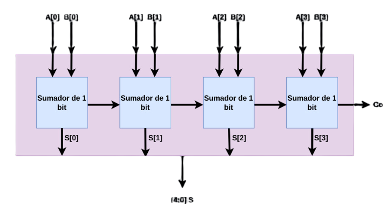

# Laboratorio 002 - Sumador de 1 y 4 bits

## Sumador de un 1 bit
Para realizar el circuito eléctrónico sumador de un bit, hicimos uso de dos compuertas XOR, dos compuertas AND y una compuerta OR. Vease la siguiente imagen.


El primer paso a seguir en la construcción del circuito es definir las entradas, que son, A, B y Ci (Acarreo de entrada). Luego, se define las salidas de cada operación lógica. Vease el siguiente bloque de código encontrado en `src/Sumador1bit/Sumador1bit.v`.

```verilog
module lab01(A,B,CI,S1,CO);
input A;
input B;
input CI;

output S1;
output CO;

wire X1; // salida de compuerta XOR 1
wire A1; // salida de compuerta AND 1
wire A2; // salida de compuerta AND 2

//Conexión de compuertas
assign X1 = A ^ B; 
assign A1 = A & B;
assign A2 = X1 & CI;
assign S1 = X1 ^ CI;
assign CO = A1 | A2;

endmodule
```

Con esto tendríamos contruido nuestro sumador de 1 bit. Ahora se procederá a probarlo en una simulación. Para simularlo se usará el programa Questa con el siguiente código como nuestro archivo Testbench en `src/Sumador1bit/Sumador1bit_tb.v`.

```verilog 
module lab01_TB(); //archivo para la simulacion

reg A_tb;
reg B_tb;
reg CI_tb;

wire S1_tb;
wire CO_tb;

lab01 uut(.A(A_tb),.B(B_tb),.CI(CI_tb),.S1(S1_tb),.CO(CO_tb));  //Se instancia el documento lab01 para ponerlo bajo prueba
initial begin
A_tb = 0;
B_tb = 0;
CI_tb = 0;
#100 //cantiadad de unidades de tiempo que quiero que las variables esten en 0
A_tb = 0;
B_tb = 0;
CI_tb = 1;
#100
A_tb = 0;
B_tb = 1;
CI_tb = 0;
#100
A_tb = 0;
B_tb = 1;
CI_tb = 1;
#100
A_tb = 1;
B_tb = 0;
CI_tb = 0;
#100
A_tb = 1;
B_tb = 0;
CI_tb = 1;
#100
A_tb = 1;
B_tb = 1;
CI_tb = 0;
#100
A_tb = 1;
B_tb = 1;
CI_tb = 1;
#100 $stop;
end

endmodule
```

El anterior código insertará los diferentes valores de las entradas por intervalo de tiempo. Acontinuación se mostrará el resultado.


El resultado de la simulación la podemos representar con la siguiente tabla de verdad:

| A   | B   | Ci  | X1  | A1  | A2  | S1  | Co  |
| --- | --- | --- | --- | --- | --- | --- | --- |
| 0   | 0   | 0   | 0   | 0   | 0   | 0   | 0   |
| 0   | 0   | 1   | 0   | 0   | 0   | 1   | 0   |
| 0   | 1   | 0   | 1   | 0   | 0   | 1   | 0   |
| 0   | 1   | 1   | 1   | 0   | 1   | 0   | 1   |
| 1   | 0   | 0   | 1   | 0   | 0   | 1   | 0   |
| 1   | 0   | 1   | 1   | 0   | 1   | 0   | 1   |
| 1   | 1   | 0   | 0   | 1   | 0   | 0   | 1   |
| 1   | 1   | 1   | 0   | 1   | 1   | 1   | 1   |

Como se puede ver en la tabla de verdad los resultados de la simulación  son los esperados para un sumador de 1 bit, por esto el siguiente paso es configurar la FPGA con Quartus para ver el comportamiento real de la misma al subir el codigo utlizado.

Primero se toma el codigo del sumador de 1 bit y se corre en Quartus para confirmar que no tenga errores:


https://github.com/AlejoHenao8/G2-E2_Digital-I/assets/159924359/a6bda13f-0fee-42d1-811e-9f9e0b13a91f


## Sumador de un 4 bit

Para realizar el circuto logico del sumador de 4 bits se aprovecha el sumador de 1 bit realizado anteriormente, de esta forma uniendo cuatro sumadores de un bit se puede obtener el sumador de 4 bit como se observa a continuación: 




`src/Sumador1bit/Sumador1bit.v`

```verilog
module lab01(A,B,CI,S1,CO);
input A;
input B;
input CI;

output S1;
output CO;

wire X1; // salida de compuerta XOR 1
wire A1; // salida de compuerta AND 1
wire A2; // salida de compuerta AND 2

//Conexión de compuertas
assign X1 = A ^ B; 
assign A1 = A & B;
assign A2 = X1 & CI;
assign S1 = X1 ^ CI;
assign CO = A1 | A2;

endmodule
```

utilizando el código del sumador de 1 bit, lo iteramos usando vectores para hacer el de 4 bits encontrado en `src/Sumador4bits/Sumador4.v` 

```verilog
`include "Sumador.v"

module sum4b(A, B, Ci, S, Co);

input [3:0] A;
input [3:0] B;
input Ci;
output [3:0] S;   
output Co;

wire C1,C2,C3;

sum1b sum0(.a(A[0]), .b(B[0]), .ci(Ci),.s(S[0]), .co(C1));
sum1b sum1(.a(A[1]), .b(B[1]), .ci(C1), .s(S[1]), .co(C2));
sum1b sum2(.a(A[2]), .b(B[2]), .ci(C2), .s(S[2]), .co(C3));
sum1b sum3(.a(A[3]), .b(B[3]), .ci(C3), .s(S[3]), .co(Co));

endmodule
```

y con su respectivo testbech en la ubicación `src/Sumador4bits/Sumador4_tb.v` donde se prueban las combinaciones $A+B=2A$, es decir, las combinaciones donde $A=B$ y se logra la simulación: 


Se nota que para los casos donde $A=B<8_{DEC}$ o $S<16_{DEC}$ los resultados de $S$ son predecibles, pero cuando $S\geq 16_{DEC}$, es decir, cuando los 4 bits ya no son suficientes para representar el número, el acarreo de salida `Co` pasa de `0` a `1`, y al poner ese bit a la izquierda de `S` cobra sentido la suma, por ejemplo con $A=B=8_{DEC}$ = $1000_{BIN}$, $Co=1_{BIN}$ por lo que el número queda $Co$ __ $S=$ $1_{BIN}$ _ $0000_{BIN}=10000_{BIN}$ o $16_{DEC}$

Por lo que genera la siguiente tabla de verdad:

| DEC |  A   |  B   | Co  |  S   | Co_S DEC |
| :-: | :--: | :--: | :-: | :--: | :------: |
|  0  | 0000 | 0000 |  0  | 0000 |    0     |
|  1  | 0001 | 0001 |  0  | 0010 |    2     |
|  2  | 0010 | 0010 |  0  | 0100 |    4     |
|  3  | 0011 | 0011 |  0  | 0110 |    6     |
|  4  | 0100 | 0100 |  0  | 1000 |    8     |
|  5  | 0101 | 0101 |  0  | 1010 |    10    |
|  6  | 0110 | 0110 |  0  | 1100 |    12    |
|  7  | 0111 | 0111 |  0  | 1110 |    14    |
|  8  | 1000 | 1000 |  1  | 0000 |    16    |
|  9  | 1001 | 1001 |  1  | 0010 |    18    |
| 10  | 1010 | 1010 |  1  | 0100 |    20    |
| 11  | 1011 | 1011 |  1  | 0110 |    22    |
| 12  | 1100 | 1100 |  1  | 1000 |    24    |
| 13  | 1101 | 1101 |  1  | 1010 |    26    |
| 14  | 1110 | 1110 |  1  | 1100 |    28    |
| 15  | 1111 | 1111 |  1  | 1110 |    30    |
