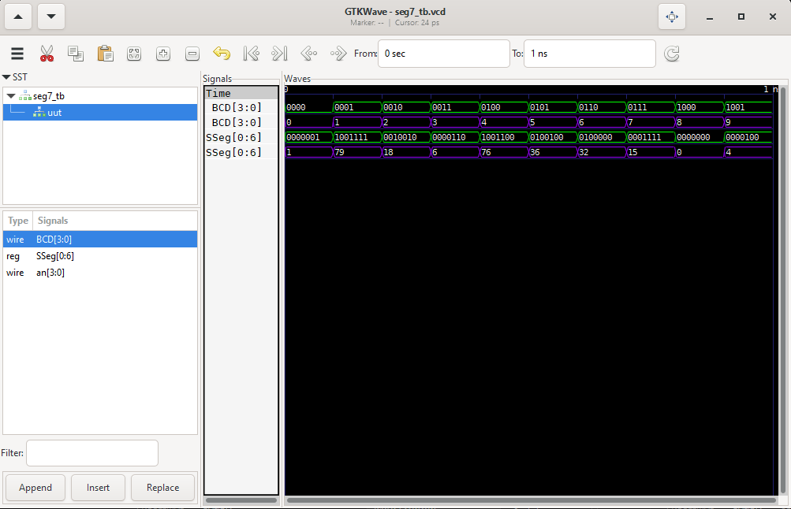
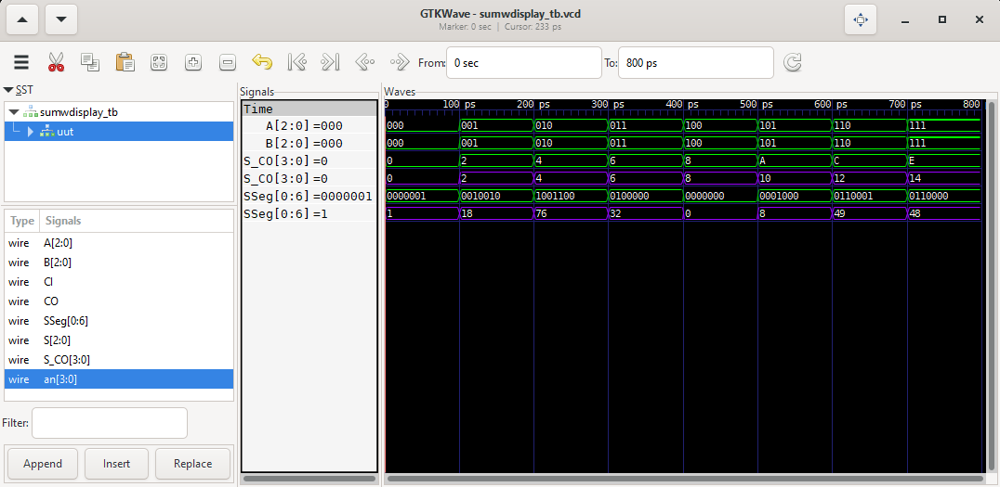

# 7 Segmentos
Primero se programa el código para representar los leds del display con códigos binarios, como se muestra en `src/Parte1/seg7.v`, donde se representan cada número binario `BCD` de máximo 4 bits (ya que el display solo puede representar hasta el 16 en `HEX` o `F`) como otro número binario `SSeg` de 7 bits, estos representan cada led `abcdefg`.
## Simulado
Se ve que en la simulación se usaron los números del 0 al 9, en verde para el número en `BIN` y en violeta su correspondiente representación en `DEC`.



## FPGA

[](https://drive.google.com/file/d/1WCeKJEhNxGwXNvRFDaoADuEJuAyZELl6/view?usp=drive_link)


https://github.com/AlejoHenao8/G2-E2_Digital-I/assets/159924359/4a03ea3c-ece5-42d6-b93d-173a806567a8


# Sumador 3 bits con 7 Segmentos
Aplicamos lo que aprendimos del `Laboratorio02` para hacer un sumador de 3 bits, y la salida (esta vez en `HEX`), la representamos en el display de 7 segmentos.
Para esto se usa la función `display` como se ve en `src/Parte2/sumwdisplay.v`

```verilog
module sumwdisplay(
  input [2:0] A, B,
  input CI,
  output [3:0] S_CO, // Salida concatenada de S y CO
  output [2:0] S,
  output CO,
  output [3:0] an,
  output reg [0:6] SSeg
);
  wire [1:0] C; // Acarreos internos
  // Concatenamos CO con S para formar S_CO
  assign S_CO = {CO, S};
  // Sumador de 3 bits
  lab03 uut(
    .A(A),
    .B(B),
    .CI(CI),
    .S(S),
    .CO(CO)
  );
  // Conexión al display de 7 segmentos
  seg7 display(
    .BCD(S_CO), // Conectamos la salida del sumador (S) al BCD del display
    .SSeg(SSeg), // Conectamos las salidas del display de 7 segmentos
    .an(an) // Conectamos la salida del display de 7 segmentos a los ánodos
  );
endmodule
```

## Simulado
Se ve que en la simulación se usaron los números en verde para el número en `BIN` para `A` y `B`, pero en HEX para `S_C0` y en violeta su correspondiente representación en `DEC`.



## FPGA

[](https://drive.google.com/file/d/1UTIxP6hIXd9viHm9mhhmLkiKXnRXI1__/view?usp=drive_link)


https://github.com/AlejoHenao8/G2-E2_Digital-I/assets/159924359/dcabfe4e-6c60-4bbf-96bb-c59a23cb0cd6


