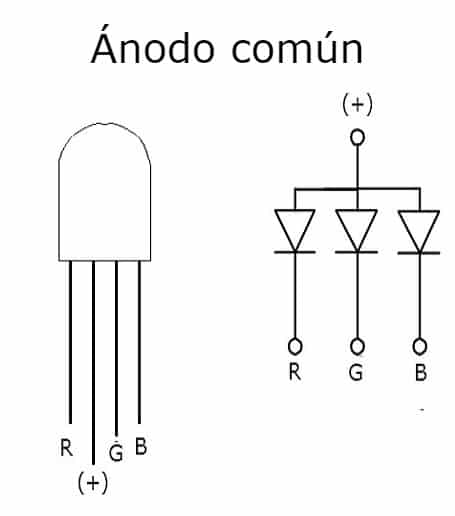
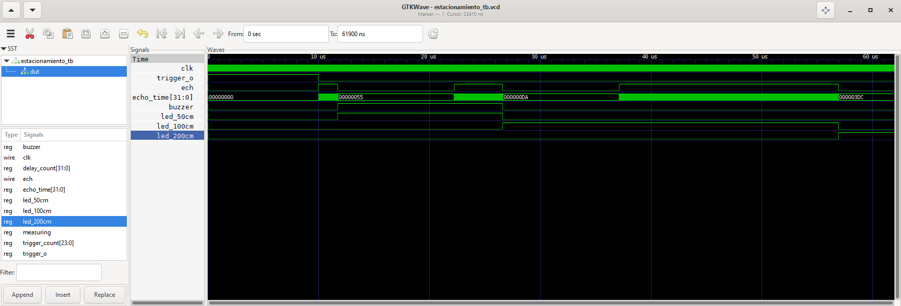

## Descripción General

El módulo `estacionamiento` es un sistema de medición de distancia por ultrasonido basado en un sensor como el HC-SR04, que utiliza un trigger y un pulso de eco (`echo`) para medir la distancia a un objeto. Dependiendo de la distancia medida, se activa un LED RGB Ánodo Común y el buzzer de la propia FPGA para indicar diferentes rangos de proximidad. Está pensado para funcionar en un FPGA con una señal de reloj (`clk`) de 50 MHz.
### Entradas y Salidas

- **Entradas:** 
    - `clk`: Señal de reloj (50 MHz en este caso).
    - `ech`: Señal de pulso de eco, proporcionada por el sensor de ultrasonido.
- **Salidas:** 
    - `trigger_o`: Señal de activación para generar el pulso de trigger (10 µs).
    - `led_50cm`: LED que se enciende si la distancia es menor o igual a 50 cm.
    - `led_100cm`: LED que se enciende si la distancia está entre 60 cm y 100 cm.
    - `led_200cm`: LED que se enciende si la distancia está entre 110 cm y 200 cm.
    - `buzzer`: Se activa si la distancia es menor o igual a 50 cm.

## Parámetros Definidos

El sistema utiliza parámetros predefinidos para las distancias y tiempos correspondientes a la medición del pulso de eco. Estos se basan en la velocidad del sonido y la frecuencia del reloj del FPGA.

### Parámetros Principales

- `CLOCK_FREQ = 50_000_000`: Frecuencia del reloj (50 MHz).
- `SOUND_SPEED = 34300`: Velocidad del sonido en el aire en cm/s.
- **Distancias de referencia**:
    - `DISTANCE_50CM = 50`: Umbral de 50 cm.
    - `DISTANCE_60CM = 60`: Umbral de 60 cm.
    - `DISTANCE_100CM = 100`: Umbral de 100 cm.
    - `DISTANCE_110CM = 110`: Umbral de 110 cm.
    - `DISTANCE_200CM = 200`: Umbral de 200 cm.

### Cálculos de Tiempos

Para cada distancia, se calculan los tiempos correspondientes en ciclos de reloj, basados en la fórmula:

$\text{Tiempo} = \frac{2 \times \text{Distancia} \times \text{Frecuencia del Reloj}}{\text{Velocidad del Sonido}}$

Sin embargo, en este código se han simplificado estos valores y se definen manualmente como constantes para cada distancia:

- `TIME_50CM = (2 * DISTANCE_50CM * CLOCK_FREQ) / SOUND_SPEED`
- `TIME_60CM = (2 * DISTANCE_60CM * CLOCK_FREQ) / SOUND_SPEED`
- `TIME_100CM = (2 * DISTANCE_100CM * CLOCK_FREQ) / SOUND_SPEED
- `TIME_110CM = (2 * DISTANCE_100CM * CLOCK_FREQ) / SOUND_SPEED
- `TIME_200CM = (2 * DISTANCE_200CM * CLOCK_FREQ) / SOUND_SPEED`

Estos valores representan los ciclos de reloj para los umbrales de distancia medidos por el sensor de ultrasonido.

## Funcionalidad Principal

El módulo utiliza dos bloques principales para controlar el comportamiento del sistema: un generador de señal de trigger y una máquina de estados para la medición del eco y la activación de los LEDs/buzzer.

### 1. Generación de Pulso Trigger

Este bloque genera un pulso de trigger de 10 µs aproximadamente, seguido de un intervalo de 60 ms antes de enviar otro pulso. El trigger se utiliza para activar el sensor de ultrasonido:

- El contador `trigger_count` controla la duración del pulso de trigger (10 µs).
- El contador `delay_count` implementa el retardo entre pulsos de trigger (aproximadamente 60 ms).

### 2. Medición del Pulso Echo

Cuando se recibe el pulso `echo`, el sistema comienza a contar el tiempo hasta que se recibe el flanco descendente (indicando el final del eco). Este tiempo se usa para calcular la distancia y activar las salidas correspondientes:

- **Inicia la medición:** Cuando el trigger se desactiva y `ech` pasa de bajo a alto, se comienza a medir el tiempo.
- **Finaliza la medición:** Cuando `ech` regresa de alto a bajo, se detiene el conteo y se determina la distancia.

### 3. Activación de LEDs y Buzzer

Dependiendo del tiempo medido (es decir, la distancia), se activan diferentes LEDs o el buzzer:

- **Distancia $\leq$ 50 cm**: Se activa el LED de 50 cm y el buzzer.
- **Distancia entre 50 cm y 100 cm**: Se activa el LED de 100 cm.
- **Distancia $\geq$ 100 cm**: Se activa el LED de 200 cm.

En esta parte, puede sorprender que en `estacionamiento.v` se está usando una lógica negada, esto es debido a que el LED RGB es Ánodo Común, por esto, para pagarlo toca enviarle una señal de `"1"` y para encenderlo una señal de `"0"` en los pines RGB.

## Inicialización de Registros

Al iniciar el sistema, todos los registros y señales se inicializan con valores predeterminados:

- `measuring`: Indicador de sí se está midiendo el tiempo del eco, inicialmente en `0`.
- `echo_time`: Contador de tiempo para la medición del eco, inicialmente `0`.
- `trigger_count`, `delay_count`: Contadores para controlar el tiempo de activación del trigger y el retardo entre pulsos.
- `trigger_o`, `led_50cm`, `led_100cm`, `led_200cm`, `buzzer`: Inicialmente desactivados.

## FSM para la Medición

El módulo sigue una máquina de estados basada en los valores de `ech` y `trigger_o`. Cuando `ech` cambia de estado bajo a alto, se comienza la medición. Cuando vuelve a estado bajo, se calcula la distancia y se determinan las salidas correspondientes.

## Conclusión

Este módulo es una implementación simple y eficiente de un sistema de medición de distancia para un sensor de ultrasonido. Utiliza un control basado en temporización para generar pulsos de trigger y medir la duración del eco. Con esta información, se activan LEDs y un buzzer para indicar la proximidad de objetos, lo que lo hace útil en aplicaciones como sistemas de estacionamiento o detección de proximidad.

# Simulación

Usando el testbench `estacionamiento_tb.v` se logró visualizar en GTKWave el comportamiento del circuito, aunque tocó darle valores muy pequeños a las variables `TIME_50CM`, `TIME_100CM` y `TIME_200CM`, ya que el simulador no soportaba tanto tiempo de simulación.

# Resultado de Laboratorio

El resultado representado en la FPGA puede verse en el siguiente [video](https://drive.google.com/file/d/1kYswuLNDf6aY5AdGtk117V4tezFsEByy/view?usp=sharing)

https://github.com/user-attachments/assets/7a20696d-8beb-4c6a-bd7d-452f602719d6

